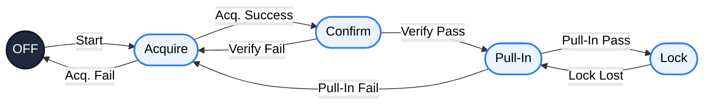
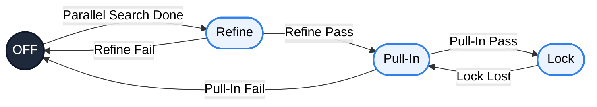

# SoC-based GPS Receiver Implementation

本專案實作了一個基於 Intel Cyclone V SoC (DE10-Nano) 平台的 GPS 接收器系統，結合了自製的 MAX2769 RF 前端模組、FPGA 硬體加速器以及 HPS 控制韌體。

## 目錄
- [SoC-based GPS Receiver Implementation](#soc-based-gps-receiver-implementation)
  - [目錄](#目錄)
  - [1. 系統架構 (System Architecture)](#1-系統架構-system-architecture)
  - [2. 目錄導覽 (Repository Structure)](#2-目錄導覽-repository-structure)
  - [3. 開發環境配置 (Development Setup)](#3-開發環境配置-development-setup)
  - [4. 硬體接線與安全須知 (Hardware Connection)](#4-硬體接線與安全須知-hardware-connection)
  - [5. 演算法架構與狀態機 (Alogorithm \& Finite State Machine)](#5-演算法架構與狀態機-alogorithm--finite-state-machine)
  - [6. 程式燒錄與執行順序 (Programming Sequence)](#6-程式燒錄與執行順序-programming-sequence)
  - [7. 運行結果與驗證 (Experimental Results)](#7-運行結果與驗證-experimental-results)
    - [7.1 測試設備 (Testing Equipment)](#71-測試設備-testing-equipment)
    - [7.2. 核心運算耗時對比 (Core Algorithm Performance)](#72-核心運算耗時對比-core-algorithm-performance)
    - [7.3 全系統定位效能與 TTFF 綜合對比 (System-Level Performance \& TTFF)](#73-全系統定位效能與-ttff-綜合對比-system-level-performance--ttff)
    - [7.4 觀測組 5 次獨立實測原始數據紀錄 (Raw Experimental Data)](#74-觀測組-5-次獨立實測原始數據紀錄-raw-experimental-data)
    - [7.5 系統定位與速度解算驗證 (PVT Verification)](#75-系統定位與速度解算驗證-pvt-verification)

## 1. 系統架構 (System Architecture)

  
  
<i>圖：系統架構圖</i>

本系統主要分為三大模組：
1. **RF Front-End**: 負責GPS L1訊號降採樣(Downsampling)。
2. **FPGA RTL**: 負責 Parallel Code Phase Search (PCPS) 加速。
3. **HPS Firmware**: 負責系統配置、追蹤運算與導航解算。

## 2. 目錄導覽 (Repository Structure)

1. [pcb frontend](pcb_frontend/) (Altium Designer Project)
    > 包含自製 MAX2769 RF 模組的設計檔案。
   - **硬體版本**: 目前推薦使用 **v3**。
   - **內容**: Altium Designer 專案、電路圖 (PDF)、製作與維修紀錄。

2. [rtl](rtl/) (Quartus Project)
    > 包含部署於 FPGA 端的 Verilog 原始碼與 Intel Quartus Prime 專案檔。
   - **核心模組**: 包含 Parallel Code Phase Search 與 Serial Search 之雙重訊號擷取架構。
   - **環境**: Intel Quartus Prime。
   - **重點**: 針對硬體並行化處理進行優化，減少擷取所需時間。

3. [firmware](firmware/) (Arm DS Project)
    > 負責執行於 HPS (ARM Cortex-A9) 之接收器韌體，透過 Avalon Bus 控制硬體暫存器。
   - [**hps_core/**](firmware/hps_core/)：**主要開發分支**。基於 ARM Compiler 6 (AC6) 環境開發，適用於個人電腦驗證。
   - [**hps_altera/**](firmware/hps_altera/)：**舊版相容分支**。基於 DS-5 (AC5) 環境開發，專供實驗室特定電腦驗證。

4. [matlab](matlab/) (MATLAB Project)
    > 包含 GPS 衛星訊號擷取演算法的模擬程式碼。
   - **主要功能**: 實現了平行碼相位搜尋演算法(Parallel Code Phase Search)。
   - **環境**: MATLAB。
   - **重點**: 作為演算法的功能模擬與設計標準，用於提前驗證演算法可行性，並作為後續 SoC 硬體開發時比對資料正確性的主要依據。

5. [document](docs/)
    > 存放專案相關的技術文件與操作指南。
   - [**how_to_apply_ds5.md**](docs/how_to_apply_ds5.md): **環境申請指南** (含 TSRI 資源、校園 DNS 正反查申請)。
   - [**emulator.md**](docs/emulator.md): **硬體操作手冊** (Agilent E4438C 與 Spirent GSS7000 操作流程)。
   - [**register_map.md**](docs/register_map.md): **暫存器映射表**。定義 HPS 與 FPGA  之間的通訊位址。
   - [**arm_core_initialization.md**](docs/arm_core_initialization.md): **ARM 核心與 RTOS 配置指南**。記錄 RTOS 環境下 Cortex-A9 時脈校正、GIC 映射與 RTX5 內核放寬執行緒上限之底層修正。

## 3. 開發環境配置 (Development Setup)

1. 硬體需求
   - **SoC開發板**: Terasic DE10-Nano (Cyclone V SoC)。
   - **射頻前端模組**: 自製 MAX2769 模組 (GPSR_frontend_v3)。
   - **訊號輸入源**: 
     1. **驗證配置**：經由同軸纜線連接至 Spirent GSS7000 訊號產生器。
     2. **實際配置 (未來)**：連接主動式 GPS 天線（需外接偏置電壓）。

2. 開發環境
   - **硬體開發**: Quartus Prime (建議 25.1 或以上版本) & Platform Designer。
   - **硬體/韌體函式庫**: Intel SoC EDS Embedded Development Suite (Version 20.1)。
   - **韌體開發環境**: Arm Development Studio (Version 2023.1) 或 DS-5 Altera Edition (Version 5.29.1)。
   - **即時作業系統**: CMSIS RTOS v2 (基於 Keil RTX5)。
   - **除錯終端**: PuTTY。

## 4. 硬體接線與安全須知 (Hardware Connection)

  
  
<i>圖：SoC GPS 接收器實驗驗證平台與硬體接線總覽</i>

1. **JTAG 偵錯**：將 mini-USB 連接至 DE10-Nano 的 **J13** 孔位並連接電腦 (用於 Quartus 燒錄及 DS-5 除錯)。
2. **UART 監控**：將 mini-USB 連接至 DE10-Nano 的 **J4**  孔位並連接電腦 (用於查看 HPS 端 UART Console 輸出結果)。
3. **RF 訊號輸入**：將 SMA Cable 連接至 Front-end 的 **J5** 孔位 (從GPS訊號產生器或天線提供 MAX2769 輸入訊號)。
4. **電源供應**：將 DC Power Cable(5V/2A) 連接至 DE10-Nano 的 **J14** 孔位，另一端連接插座。

> [!CAUTION]
> **重要上電順序提醒 (Critical Safety Warning)**
> 
> 在接通電源前，請務必確認上述 **1~3 項接線已全部連接穩固**。
> 
> **嚴禁在上電狀態下熱插拔 SMA 接頭**。由於上電瞬間可能產生瞬間脈衝 (Pulse) 或靜電，若此時才連接 SMA 接口，極易導致射頻前端 MAX2769 發生短路或因突波而燒毀。請遵循 **「先接線、後上電」** 的原則，拆卸時則反之。

## 5. 演算法架構與狀態機 (Alogorithm & Finite State Machine)

  
  
<i>圖：Serial Search 模組硬體架構圖</i>

  
  
<i>圖：Parallel Code Phase Search 模組硬體架構圖</i>

<i>圖：狀態機 - 原始架構</i>

 

<i>圖：狀態機 - 混合架構</i>

## 6. 程式燒錄與執行順序 (Programming Sequence)

> [!IMPORTANT]
> **硬體相依性原則**：必須遵循「**先燒錄 FPGA，後燒錄 ARM**」的順序。若 FPGA 尚未配置完成便啟動 ARM 程式，CPU 會因存取未啟動的 Lightweight Bridge 實體位址而發生 Data Abort 當機。

1. **載入 FPGA 硬體邏輯 (Quartus)**：
   * 使用 **Quartus Programmer** 透過 JTAG (J13) 燒錄 `.sof` 檔案。
   * *詳細硬體編譯與 IP 配置細節請參閱 [rtl/README.md](rtl/README.md)。*

2. **執行 HPS 韌體程式 (DS-5 / Arm DS)**：
   * 根據您的環境開啟對應的整合開發環境（IDE），啟動 Debug 視窗並下載 `.axf` 執行檔至 RAM 運行：
        * **現代化環境 (Arm DS / AC6 工具鏈)** 👉 使用 **[firmware/hps_core/](firmware/hps_core/)** 專案。
        * **舊版相容環境 (DS-5 / AC5 工具鏈)** 👉 使用 **[firmware/hps_altera/](firmware/hps_altera/)** 專案。
      * *注意：首次除錯前請務必閱讀各韌體目錄下的 `README.md` 以完成 Debugger 腳本（preloader.ds）的掛載。*

3. **觀察除錯終端**：
   * 將電腦連接至 DE10-Nano 的 **J4 (USB-UART)** 埠，開啟 **PuTTY**（配置為 115200 波特率），即可即時觀測衛星搜尋等資訊。

## 7. 運行結果與驗證 (Experimental Results)

本專案透過硬體模擬器驗證接收器於不同場景下的定位效能。

### 7.1 測試設備 (Testing Equipment)
若需重現驗證結果，請參閱 **[docs/emulator.md](docs/emulator.md)** 之操作指引配置硬體環境。

| 實驗環境變數 (Parameter) | 實體軟硬體配置與參數 (Configuration Details)             |
| :---------------------- | :----------------------------------------------------- |
| **射頻訊號模擬器**       | Spirent GSS7000 Multi-GNSS RF Signal Simulator         |
| **測試衛星星座**         | GPS L1 C/A (天空中包含 10 顆動態可見衛星)                |
| **底層計時解析度**       | ARM Cortex-A9 Private Timer (解析度: 1 ms)              |
| **系統排程頻率**         | CMSIS-RTOS v2 / Keil RTX5 (OS Tick Freuqency: 1000 Hz) |
| **統計實驗次數**         | 5 次獨立重複實驗 (5 Trials per Power Level)              |

### 7.2. 核心運算耗時對比 (Core Algorithm Performance)
下表展示了 SoC 平台在相同搜尋範圍下，執行不同基頻擷取演算法的純硬體運算耗時統計：

| 訊號擷取演算法         | 衛星數量 | 頻率搜索範圍 [kHz] | 總體執行時間 [ms] | 核心運算加速比 |
| :-------------------- | :-----: | :---------------: | :--------------: | :----------: |
| **直接搜尋法** <small>註1, 2</small> | 1 顆    | $0 \pm 10$        | 80,725.64        | 基準 (1.0x)   |
| **碼相位平行搜尋法**   | 1 顆    | $0 \pm 10$        | **4.07**         | **19,834x**   |
| **碼相位平行搜尋法**   | 32 顆   | $0 \pm 10$        | **117.65**       | **686x**      |

<small>**註1**：直接搜尋法之執行時間為完整搜尋所有二維搜尋空間之最大耗時。若於搜尋空間中先行命中載波頻率及碼相位，程式會提早結束。</small>

<small>**註2**：直接搜尋法可透過在 FPGA 上配置多組實體硬體通道平行搜尋不同衛星，以降低總體執行時間。</small>

### 7.3 全系統定位效能與 TTFF 綜合對比 (System-Level Performance & TTFF)
本實驗測試共用相同之基頻硬體資源（Parallel Search 模組與 13 組序列硬體相關器通道），純粹透過 **ARM 韌體排程狀態機 (FSM) 的調度策略分流**，對比系統首次定位時間（Time To First Fix, TTFF）的實測結果：

   * **混合架構 (Parallel Code Phase Search + Serial Search)**：完整驅動 FPGA 內之 Parallel Code Phase Search 硬體加速模組進行全星座快速擷取，隨後動態將參數分派予 13 組序列硬體相關器（Serial Correlator）進行精細微調與追蹤。
   * **單一架構 (Serial Search)**：於軟體層面將 Parallel 加速器暫存器關閉，冷啟動後純依賴 13 組通道進行時域與頻域的逐點掃描。為了排除純韌體超時輪詢變因、專注比對硬體搜尋物理速度，此模式下開機**預先指派模擬器中存在的 10 顆存在衛星號碼（指定 PRN）**。

| 模擬器功率 [dBm] | 架構     | 4 顆衛星達成鎖定之耗時 [s]  (範圍 / 平均值) | 首次定位時間 [s]  (範圍 / 平均值) | **硬體搜尋加速比** |
| :-------------: | :------: | :-------------------------------------------: | :---------------------------------------: | :---------------: |
| **-115**        | 單一      | 19.073 ~ 28.095 (**23.902**)                 | 51.233 ~ 60.218 (**55.570**)              | 基準 (1.0x)       |
|                 | 混合      | 1.122 ~ 3.206 (**2.139**)                    | 26.085 ~ 39.069 (**31.465**)              | **11.17x 加速**   |
| **-120**        | 單一      | 19.143 ~ 25.171 (**21.554**)                 | 46.075 ~ 56.133 (**50.134**)              | 基準 (1.0x)       |
|                 | 混合      | 1.152 ~ 2.253 (**1.943**)                    | 27.234 ~ 38.067 (**33.915**)              | **11.09x 加速**   |
| **-125**        | 單一      | 25.234 ~ 32.026 (**29.351**)                 | 47.057 ~ 74.192 (**61.511**)              | 基準 (1.0x)       |
|                 | 混合      | 28.180 ~ 84.115 (**50.725**)                 | 80.044 ~ 156.029 (**108.885**)            | **註1**           |
| **-130**        | 單一/混合 | —                                            | —                                         | **註2**           |

<small>**註1**：在 `-125 dBm` 下，混合架構因頻率觀測頻寬較寬（500 Hz vs. Serial 125 Hz），致使單一頻率分度（Bin）內累積之總雜訊功率較高。在弱訊號下，真實訊號極易低於硬體偵測門檻而遭誤判，狀態機須反覆驗證，故鎖定耗時拉長。</small>

<small>**註2**：訊號功率降至 `-130 dBm` 時，在當前配置之積分時間（Parallel Code Phase Search: 2 ms / Serial: 1 ms）限制下，相關峰值已無法超越雜訊基底，故不論何種調度模式皆無法達成穩定鎖定。</small>

> [!NOTE]
> **為什麼冷啟動 (Cold Start) 解讀導航電文至少需要 18 秒？**
> * **導航電文傳輸速率**：固定只有 50 bps（每秒 50 bits）。
> * **必備資料框 (Data Frame)**：定位解算前，韌體必須完整取得子框架 (Subframe) #1、#2 與 #3。
> * **解讀時間**：每個子框架長度為 300 bits（耗時 6 秒），連續下載並解讀完這三個必備子框架（共 900 bits），**至少需要 18 秒的連續傳輸時間**（尚未包含冷啟動後捕捉前導字元以達成框架同步的時間差）。

### 7.4 觀測組 5 次獨立實測原始數據紀錄 (Raw Experimental Data)
若需核對或重現統計大表中的範圍區間，可展開下方摺疊面板檢視各組 Run 1 ~ Run 5 的詳細觀測值：

<b>點擊展開：查看混合架構 5 次獨立實測詳細數據紀錄</b>

| 模擬器輸出功率 [dBm] | 4 顆衛星達成鎖定之耗時 [s]   (Run 1 / 2 / 3 / 4 / 5) [平均值] | 首次定位時間 (TTFF) [s]   (Run 1 / 2 / 3 / 4 / 5) [平均值] |
| :-----------------: | :------------------------------------------------------------ | :---------------------------------------------------------- |
| **-115**            | 2.134 / 3.206 / 1.122 / 3.084 / 1.151   **[Mean: 2.139]**  | 26.085 / 39.069 / 29.065 / 36.035 / 27.073   **[Mean: 31.465]** |
| **-120**            | 2.019 / 2.062 / 2.253 / 2.229 / 1.152   **[Mean: 1.943]**  | 34.078 / 37.055 / 38.067 / 33.142 / 27.234   **[Mean: 33.915]** |
| **-125**            | 28.180 / 44.113 / 60.064 / 37.154 / 84.115   **[Mean: 50.725]** | 80.044 / 98.198 / 97.006 / 113.242 / 156.029   **[Mean: 108.885]** |

 

<b>點擊展開：查看單一架構 5 次獨立實測詳細數據紀錄</b>

| 模擬器輸出功率 [dBm] | 4 顆衛星達成鎖定之耗時 [s]   (Run 1 / 2 / 3 / 4 / 5) [平均值] | 首次定位時間 (TTFF) [s]   (Run 1 / 2 / 3 / 4 / 5) [平均值] |
| :-----------------: | :--- | :--- |
| **-115**            | 23.033 / 26.176 / 19.073 / 28.095 / 23.131   **[Mean: 23.902]** | 57.134 / 56.106 / 53.161 / 60.218 / 51.233   **[Mean: 55.570]** |
| **-120**            | 23.083 / 25.171 / 20.245 / 19.143 / 20.129   **[Mean: 21.554]** | 56.133 / 46.075 / 53.237 / 48.005 / 47.221   **[Mean: 50.134]** |
| **-125**            | 32.026 / 25.234 / 31.201 / 27.118 / 31.176   **[Mean: 29.351]** | 61.137 / 47.057 / 65.145 / 74.192 / 60.025   **[Mean: 61.511]** |

 

### 7.5 系統定位與速度解算驗證 (PVT Verification)

本研究在系統鎖定穩態後進行定量分析，以驗證底層基頻演算法之絕對正確性，其實驗配置與統計要點如下：

* **PVT 更新率**：**10 Hz**（每 100 ms 解算一次）。
* **統計樣本數量**：定位成功期間，連續紀錄 **1,259 筆 有效觀測樣本**。

| 效能參數                 | 模擬器真實值      | 接收機實測平均值   | 實測誤差與統計指標   |
| :----------------------- | :--------------: | :--------------: | :----------------- |
| **ECEF X 軸位置**         | `+6378137.000 m` | `+6378135.534 m` | **1.466 m** (MAE)  |
| **ECEF Y 軸位置**         | `0.000 m`        | `-0.342 m`       | **0.342 m** (MAE)  |
| **ECEF Z 軸位置**         | `0.000 m`        | `-0.245 m`       | **0.245 m** (MAE)  |
| **平均定位誤差**           | `0.000 m`       | —                | **6.492 m**  (3D 空間平均定位誤差) |
| **定位穩定度 (SD)**        | `0.000 m`       | —                | **4.620 m**         |
| **最大定位誤差**           | —               | —                | **41.799 m**        |
| **參與定位衛星顆數**       | `10 顆`          | `10 顆`         | 訊號追蹤階段無失去鎖定 |
| **ECEF X 軸速度 ($V_x$)** | `0.000 m/s`      | —               | **0.633 m/s** (RMSE) |
| **ECEF Y 軸速度 ($V_y$)** | `0.000 m/s`      | —               | **0.245 m/s** (RMSE) |
| **ECEF Z 軸速度 ($V_z$)** | `0.000 m/s`      | —               | **0.331 m/s** (RMSE) |
| **平均速度誤差**           | `0.000 m/s`      | —              | **0.756 m/s** (3D 空間平均速度誤差) |