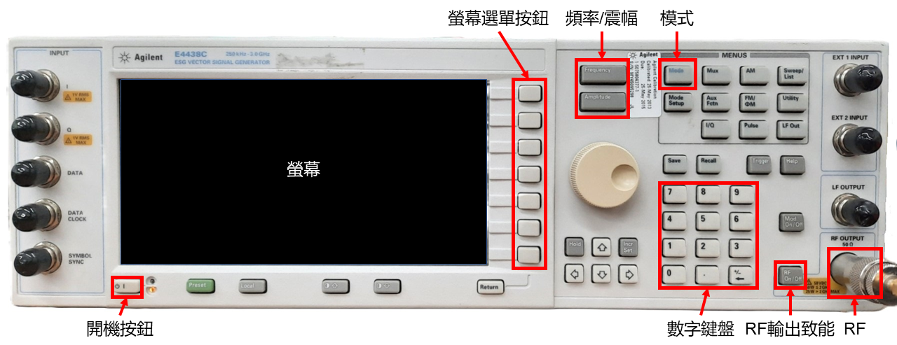
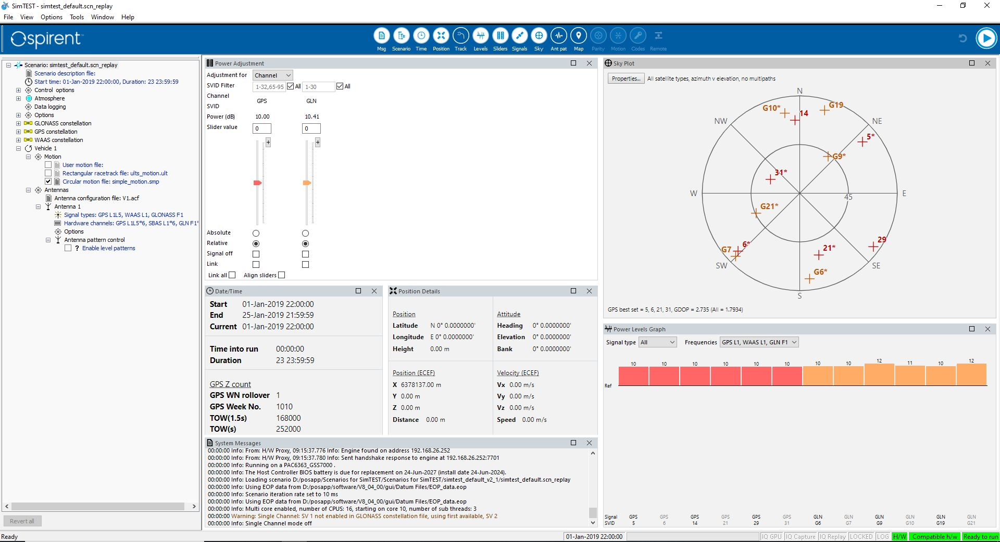

# GPS 訊號模擬器操作指南 (GPS Emulator Guide)

本文件說明實驗室內兩台 GPS 訊號模擬器的基本規格與操作流程，用於驗證 GPS 接收器之追蹤與定位功能。

## GPS 訊號模擬器 (GNSS Emulators)

| 設備名稱               | 型號    | 支援頻段與功能                                                |
| --------------------- | ------- | ------------------------------------------------------------ |
| **Agilent ESG**       | E4438C  | 支援 GPS L1 靜態/預錄場景播放。                                |
| **Spirent Simulator** | GSS7000 | 支援多系統 (GPS/GLONASS) 與多頻段 (L1/L5, G1/G2) 動態軌跡模擬。 |

## 目錄
- [GPS 訊號模擬器操作指南 (GPS Emulator Guide)](#gps-訊號模擬器操作指南-gps-emulator-guide)
  - [GPS 訊號模擬器 (GNSS Emulators)](#gps-訊號模擬器-gnss-emulators)
  - [目錄](#目錄)
  - [設備一：Agilent E4438C ESG Vector Signal Generator](#設備一agilent-e4438c-esg-vector-signal-generator)
    - [功能說明](#功能說明)
    - [操作流程](#操作流程)
  - [設備二：Spirent GSS7000 Signal Generator](#設備二spirent-gss7000-signal-generator)
    - [操作流程](#操作流程-1)
  - [設備狀態與維護紀錄](#設備狀態與維護紀錄)
    - [設備：Agilent E4438C ESG Vector Signal Generator](#設備agilent-e4438c-esg-vector-signal-generator)

## 設備一：Agilent E4438C ESG Vector Signal Generator
本設備主要用於播放預錄的 GPS L1 訊號。

  
  
<i>圖：Agilent E4438C ESG Vector Signal Generator</i>

### 功能說明

* **[開機按鈕]**：位於機器面板左下角 。
* **[數字鍵盤]**：位於面板右側，用於輸入頻率與震幅數值 。
* **[RF On/Off]**：位於右下角，這是輸出訊號的最後一道開關 。

### 操作流程
1. 核心參數設定 (Parameters)

   * **頻率 (Frequency)**: `1575.42 MHz` (GPS L1)。

2. 開機與基礎設定
   1. **開機**：按下左下角 [電源按鈕]。
   2. **設定頻率**：按壓面板上的 **[Frequency]** 按鍵，輸入 `1575.42` 並選擇螢幕選單中的 `MHz`。
   3. **設定震幅**：按壓面板上的 **[Amplitude]** 按鍵，輸入 `-110` 並選擇 `dBm`。

3. 進入 GPS 模式
   1. 按壓面板上的 **[Mode]** 按鍵。
   2. 在螢幕右側選單按下 **[More]** (1 of 3) 切換至第二頁。
   3. 選擇 **[GPS]** 進入選單。
   4. 按下 **[Real Time MSGPS]** (Multiple Satellite GPS)。
        > *註：MSGPS 可同時模擬多顆衛星；Real Time GPS 僅能模擬單一衛星。*

4. 選擇場景 (Scenario) 與播放
   1. 按下 **[Scenario]** 進入檔案清單。
   2. 使用轉盤選擇場景，例如 **[HAWAII]** 或 **[SANTAROSA]**，按下 **[Select Scenario]**。
   3. 回到主頁面，按下右側選單最上方的 **[Real-time MSGPS]** 將狀態切換為 **[On]**。
      * 此時螢幕應顯示該場景之經緯度資訊與目前在空衛星編號（Satellites in View）。
      * **注意**：此時基頻訊號已開始播放，但 RF 實體線路尚未輸出。

5. 致能 RF 輸出
   1. 按下面板右下角的 **[RF On/Off]** 按鍵。
   2. 確認螢幕上方狀態欄顯示 **[RF ON]**。
   3. 此時訊號正式從 RF 輸出孔送出至接收器。

---

## 設備二：Spirent GSS7000 Signal Generator

本設備為高階多頻段訊號模擬器，支援 GPS (L1/L5) 與 GLONASS (G1/G2) 等多系統同時模擬。

  
  
<i>圖：Spirent GSS7000 Signal Generator</i>

### 操作流程
1. 硬體與軟體啟動

   * **硬體電源**：開啟 **GSS7000** 主機電源。
   * **系統登入**：輸入 Windows 登入密碼（密碼請參閱實驗室之 **廠商附贈之操作說明(紙張為A4大小)**）。
   * **應用程式**：開啟桌面上的 `Positioning Application`。

2. 載入場景 (Scenario)

   * **檔案路徑**：`D:/posapp/Scenarios for SimTEST/Scenarios for SimTEST/simtest_default_v2_1/simtest_default.scn_replay`。
   * **備份機制**：若場景檔異常，請從 `D:/posapp/back up/Scenarios for SimTEST.zip` 解壓縮並覆蓋回原路徑。

3. 進階參數設定 (僅限播放前)

   * **接收機位置 (Position)**：點選 `simple_motion.smp` 檔案可設定初始經緯度與路徑。
   * **衛星種類 (Signal type)**：調整欲模擬的系統（如 GPS、GLONASS）。
   * **衛星數量 (Hardware Channel)**：設定各個頻段分配的衛星通道數。
   * **功率調整 (Power Level)**：
   * **重要限制**：**僅在 `Ready to run` 階段才能調整訊號強度**。一旦進入播放流程，數值將無法更動。

   * **單頻道模式 (Single Channel Mode)**：
     * 進入路徑：`File` > `Single Channel Mode`。
     * **SVID/PRN 切換**：僅在此模式下的 `Initial State` 分頁中，可以手動指定特定的衛星編號 (SVID) 或 PRN。

4. 播放流程與狀態監測

   * **開始播放**：點擊工具列的 **[Play]** 圖示。
   * **狀態觀察**：請盯住視窗右下角的狀態列，確保其依序完成以下轉變：
   `Ready to run` $\rightarrow$ `Arming` $\rightarrow$ `Trigger wait` $\rightarrow$ **`Running`**。
   * **正式輸出**：必須等到狀態顯示為 **`Running`**，硬體才會正式輸出 RF 訊號。

 5. 結束與恢復

      * **停止播放**：點選 **`[Stop]`** 按鈕，系統停止撥放場景。
      * **解除鎖定**：點選 **`[Revert]`** 按鈕，系統才會釋放播放時的參數鎖定並恢復至場景初始值。

## 設備狀態與維護紀錄

### 設備：Agilent E4438C ESG Vector Signal Generator
* **現況說明**：本設備為二手老舊儀器（近期測試日期：2023年06月19日）。
* **故障排查（Troubleshooting）**：若在硬體連接完全正確的前提下，GPS 接收器（Receiver）仍無法順利解算定位（Position Fix），在排除硬體接線與韌體設定後，應優先懷疑訊號產生器之 RF 輸出異常。
* **原廠/第三方檢修資訊**：
  * 檢修廠商：全測儀器科技股份有限公司 (AllTestek)
  * 官方網站：[全測儀器科技](https://www.alltestek.com/)