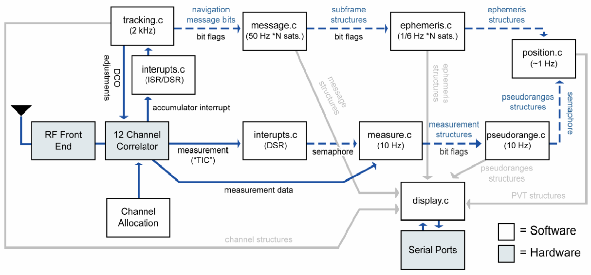
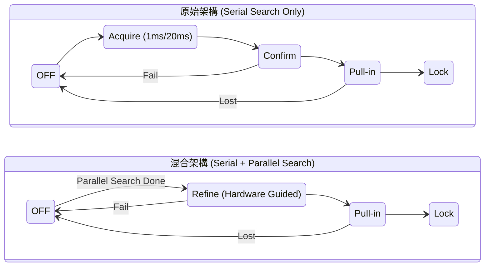

# GPSR - ARM HPS Bare-metal Implementation
本專案實作於 **Intel Cyclone V SoC (DE10-Nano)** 平台，核心基於 **CMSIS RTOS v2** 進行任務排程，並透過 HPS 驅動 FPGA 端的 GPS 訊號擷取加速電路。

## 目錄
- [GPSR - ARM HPS Bare-metal Implementation](#gpsr---arm-hps-bare-metal-implementation)
  - [目錄](#目錄)
  - [1. 開發環境 (Prerequisites)](#1-開發環境-prerequisites)
  - [2. 專案架構與配置 (Project Structure)](#2-專案架構與配置-project-structure)
    - [核心檔案與配置](#核心檔案與配置)
    - [模組說明 (SRC / INC)](#模組說明-src--inc)
    - [軟體組件配置 (RTE Configuration)](#軟體組件配置-rte-configuration)
      - [HPS 底層暫存器與時脈校正說明](#hps-底層暫存器與時脈校正說明)
  - [3. 系統架構 (System Architecture)](#3-系統架構-system-architecture)
    - [硬體加速層 (FPGA)](#硬體加速層-fpga)
    - [軟體控制層 (CMSIS RTOS v2)](#軟體控制層-cmsis-rtos-v2)
    - [系統交互數據流 (Data Flow Diagram)](#系統交互數據流-data-flow-diagram)
  - [4. 如何執行 (Getting Started)](#4-如何執行-getting-started)
    - [Step 1: 匯入專案 (Import Project)](#step-1-匯入專案-import-project)
    - [Step 2: 編譯專案 (Build Project)](#step-2-編譯專案-build-project)
    - [Step 3: 硬體連線與除錯配置 (Debug Configuration)](#step-3-硬體連線與除錯配置-debug-configuration)
    - [Step 4: 顯示輸出資訊 (Monitoring)](#step-4-顯示輸出資訊-monitoring)
  - [5. 硬體資源配置 (Hardware Resource Allocation)](#5-硬體資源配置-hardware-resource-allocation)
    - [5.1 暫存器映射與基底位址 (Register Map \& Base Address)](#51-暫存器映射與基底位址-register-map--base-address)
    - [5.2 執行緒清單 (Thread List)](#52-執行緒清單-thread-list)
    - [5.3 中斷向量映射 (Interrupt Mapping)](#53-中斷向量映射-interrupt-mapping)
  - [6. 技術實作細節 (Implementation Details)](#6-技術實作細節-implementation-details)
    - [6.1 軟體架構與執行緒 (Software Architecture \& Threads)](#61-軟體架構與執行緒-software-architecture--threads)
    - [6.2 平行碼相位搜尋流程 (Parallel Code Phase Search Flow)](#62-平行碼相位搜尋流程-parallel-code-phase-search-flow)
    - [6.3 數據流與狀態轉移 (Data Flow \& FSM)](#63-數據流與狀態轉移-data-flow--fsm)
      - [6.3.1 狀態轉移對照圖 (State Machine Comparison)](#631-狀態轉移對照圖-state-machine-comparison)
      - [6.3.2 邏輯說明](#632-邏輯說明)
  - [7. 已知問題與解決方案 (Known Issues)](#7-已知問題與解決方案-known-issues)
  - [專案參考 (References)](#專案參考-references)
    - [硬體與底層技術手冊](#硬體與底層技術手冊)
    - [開源框架與學術文獻](#開源框架與學術文獻)


## 1. 開發環境 (Prerequisites)
* **硬體平台**: Terasic DE10-Nano (Cyclone V 5CSEBA6U23I7)。
* **開發環境**: ARM Development Studio (DS) Golden Edition (Version 2023.1)。
* **開發套件**: SoC FPGA Embedded Development Suite Standard Edition (Version 20.1)。
* **作業系統**: CMSIS RTOS v2 (基於 Keil RTX5)。
* **編譯器**: ARM Compiler 6 (AC6)。
* **終端機軟體**: PuTTY (用於透過 UART 觀察系統輸出與 HPS 狀態)。
* **硬體需求**: 需先透過 Quartus 編譯並產生 `.rbf` 檔案載入 FPGA，確保 HPS 可透過 Lightweight HPS-to-FPGA Bridge 存取暫存器。

## 2. 專案架構與配置 (Project Structure)

本專案採模組化設計，將硬體底層驅動、GPS 核心演算法與 RTOS 系統配置分離。

### 核心檔案與配置

* **`DE10_serial_parallel/main.c`**: 程式進入點，負責 線程(Threads)初始化、硬體周邊配置及啟動 CMSIS RTOS v2 核心任務。
* **`DE10_serial_parallel/DE10_serial_parallel.rteconfig`**: ARM Development Studio 的運行環境配置文件，定義組件相依性。
* **`DE10_serial_parallel/config_hardware/`**: 存放偵錯配置檔 (`.launch`)，記錄 JTAG 連線參數與應用程式下載設定。
* **`bootloader/preloader.ds`**: ARM DS 除錯腳本，用於引導硬體初始化。該腳本會加載並執行同目錄下的 **`u-boot-spl`**，完成 HPS 側的 UART、DDR 記憶體及多功能引腳 (I/O Multiplexing) 的初始化，確保應用程式能正確下載至 RAM 運行。

### 模組說明 (SRC / INC)

檔案依功能劃分為以下四大模組：

| 模組類別           | 包含檔案 (實作/標頭檔)                                    | 說明                                                                    |
| ----------------- | -------------------------------------------------------- | ---------------------------------------------------------------------- |
| **系統與通訊**     | `uart.c`, `display.c`, `message.c`                       | 負責 HPS UART 偵錯輸出、數據格式封裝及資訊顯示。                          |
| **硬體驅動層**     | `max2769.c`, `altera_avalon_spi.c`, `parallel_search.c`  | 處理 RF 前端 (MAX2769) 配置、Avalon Bus 通訊及**平行搜尋硬體加速器**控制。 |
| **GPS 核心演算法** | `tracking.c`, `measure.c`, `ephemeris.c`, `position.c`   | 實現衛星信號追蹤、虛擬距離測量、星曆解析及定位運算 (PVT)。                 |
| **導航計算工具**   | `DOP.c`, `pseudorange.c`, `allocate.c`, `time.c`         | 處理幾何精度因子計算、時間同步及衛星通道分配邏輯。                         |

### 軟體組件配置 (RTE Configuration)

匯入專案後，請雙擊打開 `.rteconfig` 檔案，確保 **Manage Run-Time Environment** 視窗中已正確勾選以下組件，這對於 **ARM Compiler 6 (AC6)** 的編譯至關重要：

| 類別 (Category)     | 組件名稱 (Component)               | 變體 (Variant) | 實測版本 (Version) | 說明                                              |
| ------------------ | ---------------------------------- | -------------- | ----------------- | ------------------------------------------------ |
| **ARMCA9**         | -                                  | -              | **1.1.0**         | 提供 Cortex-A9 核心基礎定義。                      |
| **CMSIS**          | **CORE**                           | -              | **6.1.0**         | 提供 Cortex-A9 核心基礎定義。                      |
| **CMSIS**          | **OS Tick (API) -> Private Timer** | -              | **1.0.2**         | 提供 RTOS 系統時間，確保任務切換與延時運算之精準度。 |
| **CMSIS**          | **RTOS2 (API) -> Keil RTX5**       | **Source**     | **5.9.0**         | 核心任務調度器，負責多執行緒並行運作。              |
| **CMSIS-Compiler** | **STDIN/STDOUT (API) -> Custom**   | -              | **1.1.0**         | 將 `printf` 重新導向至 `uart.c`。                 |
| **Device**         | **IRQ Controller (API) -> GIC**    | -              | **1.2.0**         | 管理來自 FPGA 端之 **FPGA_IRQ0/1** 中斷。          |
| **Device**         | **Startup**                        | -              | **1.2.0**         | 包含啟動引導、Scatter file 與 **MMU 配置**。       |

#### HPS 底層暫存器與時脈校正說明

本專案在 ARM DS / DS-5 環境下，已針對 CMSIS 產生的預設 `ARMCA9` 核心配置進行了關鍵修正（包含 GIC/Timer 實體位址重對映、925 MHz 4分頻時脈校正、關閉 MMU 以及鎖定 `-O0` 編譯優化）。

* **完整相容性原理與核對清單**：請參閱詳細技術指南 [docs/arm_core_initialization.md](../../docs/arm_core_initialization.md)
* *註：相關修正已完好儲存於本專案的 `INC/` 與設定檔中，匯入後自動覆蓋預設值，此文件僅供原理核對使用。*


## 3. 系統架構 (System Architecture)
本系統將 GPS 接收器的處理邏輯分為「即時韌體控制」與「硬體運算加速」兩大部分：

### 硬體加速層 (FPGA)

* **Serial Search**: 負責多通道的關聯運算（Correlators）與衛星追蹤。
* **Parallel Code Phase Search**: 負責快速擷取衛星訊號，大幅縮短首次定位時間 (TTFF)。
* **MAX2769 SPI 控制**: 負責 RF 前端參數設定。

### 軟體控制層 (CMSIS RTOS v2)

* **Task Scheduling**: 包含衛星搜尋任務、追蹤環路任務、以及數據遙測傳輸任務。
* **Event Handling**: 利用 RTOS Event Flags 或 Semaphores 響應硬體中斷。

### 系統交互數據流 (Data Flow Diagram)
本專案之軟硬體交互邏輯參考自經典的開源導航專案 Namuru GPS，並針對 Cyclone V HPS 進行了移植與優化：

<center>
  
  <p><i>圖：Namuru V2 框架之數據流圖（圖片來源：<a href="https://www.semanticscholar.org/paper/The-Namuru-V2-open-source-GNSS-receiver-project-Mumford-Akos/fdfd5889722f786af1faafd68cfd5bef9aa55d25" target="_blank">The Namuru V2 Project</a>）</i></p>
</center>

## 4. 如何執行 (Getting Started)
本節說明如何將專案匯入 **ARM Development Studio**、編譯並透過 **USB-Blaster II** 進行硬體偵錯。

### Step 1: 匯入專案 (Import Project)

1. 啟動 **ARM Development Studio** (Golden Edition)。
2. 點選選單 `File` -> `Switch Workspace` -> `firmware/hps_core`。
3. 點選選單 `File` -> `Import...`。
4. 選擇 `General` -> `Existing Projects into Workspace`，並點選 `Next`。
5. 在 `Select root directory` 中點選 `Browse..`，路徑切換至 `firmware/hps_core/DE10_serial_parallel` 目錄後點選 `選擇資料夾`。
6. 在 `Projects` 清單中勾選 `DE10_serial_parallel`，最後點選 `Finish`。

### Step 2: 編譯專案 (Build Project)

1. 點選選單 `Project` -> `Build All`。
2. **編譯檢查**：
   * 出現 **Warnings** 通常為編譯器優化建議，尚可接受。
   * 若出現 **Errors** 則代表 `.axf` 執行檔未成功生成，請檢查 Include 路徑或 CMSIS 庫配置。

### Step 3: 硬體連線與除錯配置 (Debug Configuration)

1. **硬體連結**：
   * 使用一條 **Mini USB 線** 連接 DE10-Nano 上的 **USB-Blaster II 埠** (J13) 與開發電腦。
   * 無需外接額外的偵錯器硬體，該連線同時提供 JTAG 偵錯與 UART 通訊功能。

2. **硬體檢查**：
   * **指撥開關 (MSEL)**：請確保DE10-Nano 上的 **MSEL[4:0]** 開關設定為 `01010` (FPP 模式)以允許 HPS 透過 FPGA Manager 配置硬體。
   * **FPGA 載入狀態**：在啟動 DS 偵錯前，請務必透過 Quartus Programmer 載入對應的 `.rbf` 檔案。
    > [!IMPORTANT]
    > * **重要安全機制**：若 FPGA 未載入或 Bridge 未開啟，HPS 存取 `0xFF200000` 位址空間時會導致 **Data Abort (資料終止異常)**，造成系統當機。

3. **偵錯配置**：
   * 在 `Debug Control` 視窗點選 `Connect with an existing Config...` 並選擇 `config_hardware`。
   * **若無法連線 (Unable to connect)**，請手動校對設定：
     * **Connection**: 選擇 `Intel SoC FPGA` -> `Cyclone V SoC (Dual Core)` -> `Bare Metal Debug` -> `Debug Cortex-A9_0`。
     * **Bare Metal Debug**: 確保顯示 `DE-SoC on localhost [USB-1]`。
     * **Files 標籤頁**: 檢查 `Application on host to download` 是否指向 `${workspace_loc:/DE10_serial_parallel/Debug/DE10_serial_parallel.axf}` 並勾選 `Load symbols`。
     * **Debugger 標籤頁**: 在 `Run control` 選擇 `Debug from symbol` 並填入 `main`；同時確保 `Run target initialization debugger script` 已載入 `${workspace_loc:/DE10_serial_parallel/bootloader/preloader.ds}` 以完成 HPS 初始化。
     * **OS Awareness 標籤頁**: 在 `Select OS awareness` 選擇 `Keil CMSIS-RTOS RTX`，以利在偵錯時觀察 **RTOS v2** 任務狀態。

4. **開始偵錯與執行**：
   * 確認上述設定無誤後，點選視窗右下角的 **`Debug`** 按鈕。
   * **下載與掛載**：IDE 將會開始燒錄 `.axf` 執行檔至 HPS 記憶體，並根據設定自動停在 `main` 函式的起始點。

5. **啟動運行**：在 `Debug Control` 視窗點選 `Continue (F8)`，系統才會正式進入 main 並啟動核心調度。

### Step 4: 顯示輸出資訊 (Monitoring)

1. **確認 COM Port 編號**：
   * 在 Windows 任務欄的「開始」圖示點選右鍵，選擇 **「裝置管理員 (Device Manager)」**。
   * 展開 **「連接埠 (COM 和 LPT)」** 項目。
   * 尋找名稱含有 **`Altera USB-Blaster II`** 或 **`USB Serial Port`** 的項目，並記下其後方的編號（例如：`COM3`）。

2. **開啟並配置 PuTTY**：
   * 啟動 **PuTTY** 程式。
   * 在 `Connection type` 選擇 **`Serial`**。
   * 在 `Serial line` 欄位輸入剛才確認的編號（如 `COM3`）。
   * 在 `Speed` 欄位輸入 **`115200`** 。
   * 點選 **`Open`** 開啟終端機視窗。

3. **開始執行與觀測**：
   * 回到 ARM DS 偵錯界面，點選 `Debug Control` 中的 **`Continue (F8)`**。
   * 此時系統正式啟動，你可以在 PuTTY 視窗中即時觀測到 GPS 接收器的初始化資訊、衛星追蹤狀態以及經緯度等運算數據。

## 5. 硬體資源配置 (Hardware Resource Allocation)

本專案透過 **Lightweight HPS-to-FPGA Bridge** 存取 FPGA 端的自定義模組，並透過 **GIC (Generic Interrupt Controller)** 進行即時事件管理。

### 5.1 暫存器映射與基底位址 (Register Map & Base Address)

所有硬體模組均掛載於 HPS 物理位址 `0xFF200000` 開始的空間。

| 模組名稱 | 系統基底位址 (System Base) | 內部偏移量 (Offset) | 說明 |
| --- | --- | --- | --- |
| **Serial Search** | `0xFF200000` | `0x000` | 13 個衛星追蹤通道與系統時序控制。 |
| **Parallel Search** | `0xFF200400` | `0x400` | 平行碼相位搜尋加速模組 (Acquisition)。 |
| **MAX2769** | `0xFF200820` | `0x820` | 射頻前端 SPI 控制暫存器。 |

詳細的定義與暫存器描述請參考：  
👉 [詳細暫存器定義說明書](../../docs/register_map.md)

### 5.2 執行緒清單 (Thread List)

| 線程 (Thread)                | 優先度 (Priority)        | 功能說明                                         |
| ---------------------------- | ----------------------- | ----------------------------------------------- |
| **`measure_thread`**         | `osPriorityRealtime`    | 負責計算 PVT (Position, Velocity, Time) 解算。   |
| **`message_thread`**         | `osPriorityHigh`        | 負責導航電文子框 (Subframe #1~#5) 的內容解析。    |
| **`parallel_search_thread`** | `osPriorityAboveNormal` | 觸發 Parallel Search 硬體加速模組並讀取解算結果。  |
| **`allocate_thread`**        | `osPriorityAboveNormal` | 分配與初始化 Serial Search 通道參數。             |
| **`display_thread`**         | `osPriorityNormal`      | 透過 UART0 即時顯示系統狀態與衛星資訊。            |

### 5.3 中斷向量映射 (Interrupt Mapping)

中斷訊號直接連接至 HPS GIC，驅動對應的處理函數與事件轉發。

| 中斷來源 (Interrupt) | GIC ID | 處理函數 (Handler)    | 功能說明                                         |
| ------------------- | ------ | --------------------- | ----------------------------------------------- |
| **FPGA_IRQ0**       | 72     | `tracking_IRQ`        | 每 0.5ms 由 FPGA 發送，更新各通道追蹤狀態與參數。  |
| **FPGA_IRQ1**       | 73     | `parallel_search_IRQ` | Parallel Search 運算完成時觸發，讀取硬體運算結果。 |
| **UART0_IRQ**       | 194    | `set_display_command` | 鍵盤敲擊觸發 (RX IRQ)，讀取使用者輸入字元。        |

## 6. 技術實作細節 (Implementation Details)

### 6.1 軟體架構與執行緒 (Software Architecture & Threads)

本專案基於 **CMSIS RTOS v2** 實現多執行緒並行處理，主要執行緒分配如下：

```c
// 核心任務初始化
allocate_thread_id        = osThreadNew(allocate_thread, ...);        // 衛星通道分配與狀態管理
parallel_search_thread_id = osThreadNew(parallel_search_thread, ...); // 平行搜尋模組調度
message_thread_id         = osThreadNew(message_thread, ...);         // 導航電文解析 (50 Hz)
measure_thread_id         = osThreadNew(measure_thread, ...);         // 虛擬距離測量 (10 Hz)
display_thread_id         = osThreadNew(display_thread, ...);         // 終端機資訊輸出
```

### 6.2 平行碼相位搜尋流程 (Parallel Code Phase Search Flow)

為縮短擷取時間，系統採用「混合式搜尋架構」。當 `allocate_thread` 偵測到通道閒置時，會透過 `osThreadFlags` 通知 `parallel_search_thread` 啟動硬體加速器。

* **執行效率對比**：相較於直接搜尋法（需時約 80,725 ms），本專案的平行搜尋演算法僅需 **4.07 ms** 即可完成單顆衛星搜尋，效能提升顯著。
* **同步機制 (Slew Control)**：在取得碼相位（Code Phase）後，韌體會計算理論 Slew 值並調整衛星通道 NCO，確保硬體追蹤通道能精準鎖定訊號。

| 訊號擷取演算法 | 衛星數量 | 搜尋範圍 | 執行時間 | 效能提升 |
| --- | --- | --- | --- | --- |
| **Serial Search** | 1 顆 | $\pm 10$ kHz | ~80,725 ms | 基準 |
| **Parallel Code Phase Search** | 1 顆 | $\pm 10$ kHz | **4.07 ms** | **~19,800x** |

### 6.3 數據流與狀態轉移 (Data Flow & FSM)

本專案優化了衛星通道的狀態機轉移邏輯，將原本序列搜尋（Serial Search）所需的擷取與確認階段，簡化為由硬體加速器引導的 `Refine` 階段。

#### 6.3.1 狀態轉移對照圖 (State Machine Comparison)


#### 6.3.2 邏輯說明

* **原始架構**：必須經歷 `Acquire`（擷取）與 `Confirm`（確認）階段，這在 Serial Search中是透過不斷位移碼相位與載波頻率來實現的，也是最耗時的部分。
* **混合架構 (本專案)**：新增了 **`Refine`** 狀態。 由於 **Parallel Code Phase Search** 模組已經提供了精確的初始相位與頻率偏移，韌體僅需在 `Refine` 階段進行最後的窄頻對齊，即可直接跳轉至 `Pull-in` 鎖定，取代了訊號擷取耗時的搜尋流程。

## 7. 已知問題與解決方案 (Known Issues)
* **Linker Warning L6329W**: 
  - 現象：`Pattern *(correlation_section) only matches removed unused sections.` / `Pattern *(data_CDC_section) only matches removed unused sections.`
  - 原因：Scatter file 預留了資料交換區塊，但目前的實作尚未宣告對應變數。
  - 影響：不影響功能，可忽略或在 .sct 檔中註解。

* **GPS 週數翻轉物理限制 (GPS Week Rollover Handling)**:
  - **位置**：`ephemeris.c` 中的 `process_subframe1()` 函式。
  - **現象**：GPS 導航電文第一子框架（Subframe 1）中的週數（Week Number）欄位僅有 10 bits，其物理上限為 $2^{10} = 1024$ 週（約 19.7 年），期滿即觸發 Rollover 清零。目前底層舊有常式採用硬編碼（Hard-coded）直接加 1024 週的方式來盲猜當前世紀時間。
  - **影響與修正建議**：此機制會導致全系統在面臨 **Rollover #2（2019/04/06）** 之後的現代真實時間場景時產生解算誤差（例如將目前時間誤判為 2000 ~ 2019 年之間）。若需將本系統部署於真實空域或最新模擬器場景中進行長時間量測，**請務必修改該處常式，根據當前真實年份將模數偏置（Offset）調整為 2048 週**，以利後端 PVT 矩陣導出正確的 UTC 時間戳記。

## 專案參考 (References)

### 硬體與底層技術手冊

* **[Intel Cyclone V HPS Address Map](https://www.intel.com/content/www/us/en/programmable/hps/cyclone-v/hps.html)**: 詳列 HPS 暫存器定義、中斷 ID 以及 **Lightweight HPS-to-FPGA Bridge** 的物理位址映射。
* **[Terasic DE10-Nano User Manual](https://www.terasic.com.tw/cgi-bin/page/archive.pl?Language=English&No=1046&PartNo=4)**: 提供開發板電路架構、USB-Blaster II 介面及周邊 Pinout 說明。
* **[CMSIS RTOS v2 Documentation](https://arm-software.github.io/CMSIS_5/RTOS2/html/index.html)**: 關於 `osThreadNew`、`osThreadFlags` 等 API 使用規範之官方文件。

### 開源框架與學術文獻

* **[Namuru V2 GNSS Project Reference](https://unsworks.unsw.edu.au/bitstreams/432f137e-324f-4682-beb5-ab08175aabf0/download)**: 本專案之軟體框架（如任務優先權、數據流結構）高度參考此開源專案。該報告由新南威爾斯大學 (UNSW) 發表，提供 12 Channel Correlator 與導航電文解析之核心邏輯。
