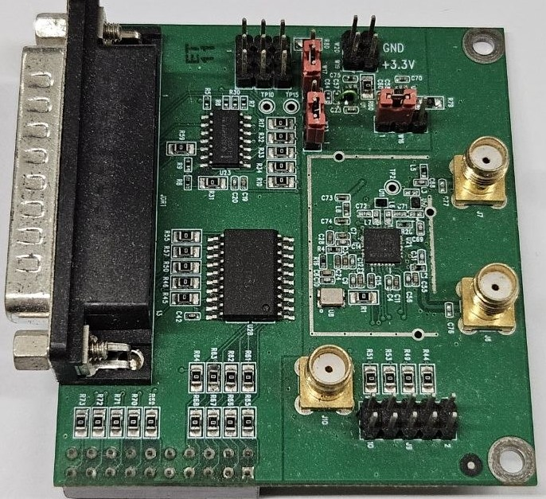
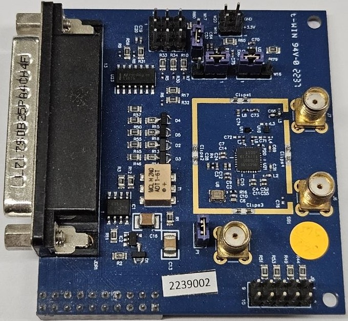
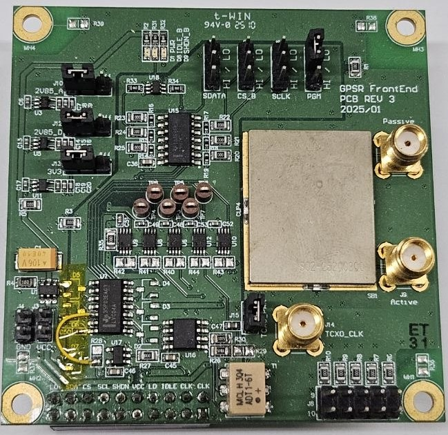

# Front-End (GNSS RF Module)

本文檔記錄了基於 **MAX2769** 的 GNSS 前端（Front-End）開發過程，包含從 v1 到 v3 的硬體迭代細節、已知問題與解決方案。

## 開發工具與關鍵零件

* **PCB 軟體**: Altium Designer
* **核心晶片 (MAX2769)**:
  * **v1, v3**: 使用 `MAX2769ETI/V+` (已停產)
  * **v2**: 使用 `MAX2769BETI/V+` ([Mouser 連結](https://mou.sr/4noLCAx))

* **重要提醒**: Sign/Mag 訊號是在 Clock 的上升緣變化，因此建議在 Clock 下降緣進行採樣，以確保資料穩定([datasheet - MAX2769](https://www.mouser.tw/datasheet/3/1014/1/MAX2769B.pdf))。
* 電路圖:
  * [Schematic - Version 1](./v1/GPSR_frontend_v1.pdf)
  * [Schematic - Version 2](./v2/GPSR_frontend_v2.pdf)
  * [Schematic - Version 3](./v3/GPSR_frontend_v3.pdf) 

## 版本更迭 (Version History)

* **Version 0**: 使用 MAX2769 Evaluation Boards（包含燒錄 config 板與 front-end 板）。
* **Version 1**: 依照 MAX2769 datasheet 標準電路設計。
* **Version 2**: 根據 v1 進行改版，優化屏蔽、抗干擾與時鐘同步設計。
* **Version 3**: 解決輸出電壓位準、訊號 ringing 及電源相容性問題。

| 版本 | v1 | v2 | v3 |
| :--: | :--: | :--: | :--: |
|照片||||

## 生產與庫存記錄

* **最後更新日期**: 2026/05/11

| 版本         | v0  | v1  | v2         | v3         |
| ------------ | --- | --- | -----------| ---------- |
| 原始生產數量 | 1+1 | 10  | 10         | 10         |
| 現存/可用數  | 1+1 | 2   | 10         | 9          |
| 交期         | -   | -   | 2022/09/16 | 2025/03/14 |

*備註：v0 係因原廠開發板配置；v1~v3 原始生產均為 10 片，數量減少源於研發過程損耗。*

---

## 相對前版本的更新 (Key Updates)

### v1 → v2

* **電路簡化**: 移除 I/Q Buffer (SN74ACT241DW)。
* **抗干擾**: 增加屏蔽框 (Shielding case)，減少外部 EMI 影響。
* **時鐘系統**:
  * TCXO 由 IT5305BE 更換為 **D32G-016.368M**。
  * 增加時鐘緩衝電路 (ADTI-6T+, MAX961ESA+, SN74LV1T34DBVRG4)。
* **訊號與保護**:
  * 更換濾波器為 SF14-1575F5UUA1。
  * 增加 GPIO 位準保護二極體 (BAT54STA)。
  * 核心晶片更換為 **MAX2769BETI+T**。

* **多天線同步設計**:
  * 增加 Header (P1) 與 SMA (J10) 設計。雙天線模式下，第二塊板需斷開 Header 並透過 J10 共享第一塊板的時鐘，以達成採樣同步。

* **特殊版本**: 10 片中透過 U11 濾波器區分：
  * **6 片 (2239000~2239005)**: GPS 頻段 (RSF-1575.420)。
  * **4 片 (2239006~2239009)**: GLONASS 頻段 (RSF-1582.400)。

### v2 → v3

* **控制介面**: 移除 D-Connector 25，改由 DE10-Nano 進行 SPI 設定。
* **電源增強**:
  * 支援 **3.3V / 5V 電壓輸入**。
  * 增加防反接保護電路 (U1A/U1B)。
  * 增加獨立 LDO (MAX8510) 穩定供電給 TCXO、Buffer 與保護電路。

* **訊號品質優化**:
  * 解決 I/Q 輸出電壓偏低 (2.85V → 3.3V) 與 ringing 問題，增加輸出 Buffer (SN74LVC1404 / SN74LVC04)。
  * 增加 GPIO 20-pin 磁珠濾波。

* **狀態顯示**: 增加指示燈 (PWR / IDLE_B / SHDN_B)，**三燈全亮**方可正常運作。

## 已知問題 (Hardware Bugs)

### v1

* PCB 原始檔案遺失。
* **電源限制**: 僅支援 3.3V 輸入，輸入 5V 會直接損毀板子。

### v2 (FAILED 版本)

* **封裝錯誤**: BAT54STA 封裝與零件不符，需人工跳線修正。
* **機構問題**: 鎖孔位置偏離，無法與 DE10-Nano 對齊。
* **接地缺陷**: MAX2769 Pin 29 (EP) 與濾波器 Pin 3 未接至 AGND，影響散熱與 EMI。
* **供電不足**: TCXO 實測僅 2.85V（應為 3.3V），導致採樣異常。
* **邏輯錯誤**: LD_OUT 未連接至 MAX2769。
* **高昂成本**: 時鐘緩衝電路零件昂貴（近 NT$ 1,000）且僅解決 CLK 訊號。

### v3

* **保護電路風險**: BAT54STA 在持續過壓時會將電流拉向 VCC/GND，可能導致整板電源軌毀損。
* **高昂成本**: 時鐘緩衝電路零件昂貴（近 NT$ 1,000）且僅解決 CLK 訊號。
* **數位失真**: GPIO 上的磁珠會導致高速數位訊號（CLK_OUT、I/Q 等）嚴重失真。

## 解決辦法 (Fixes)

### v3 必要的硬體修正步驟

1. **解決訊號失真**:
   * 將磁珠 **FB13, FB15, FB17** 更換為 **0Ω (0402)** 電阻。
   * 直接 **移除** 磁珠 FB1, FB2, FB4, FB8。

2. **邏輯與跳線**:
   * 移除電阻 **R28, R29**。
   * 跳線：連接 **U7 (SN74LVC04ADR) pin 12** 至 **R28 pin 2**。
   * C54, R45 不須焊接。

3. **成本降低建議**:
   * 若不需特定時鐘緩衝，建議移除 T1, U16, U17 及其周邊電路。

---

## GPIO 定義表
> [!NOTE]
> **注意**: v1, v2 版本請務必使用 **PIN 2 (CLK_OUT)** 作為主要時鐘源，避免使用經過 Buffer 後失真的 PIN 19。

| PIN | 變數 | 用途 | 來源地 (MAX2769) | 說明 |
| --- | --- | --- | --- | --- |
| 1 | I+ | i_sign | PIN 21 (I1_OUT) |  |
| 2 | CLK_OUT | CLK | PIN 16 (CLK_OUT) | v1, v2 主要時鐘源 |
| 3 | I- | i_mag | PIN 20 (I0_OUT) |  |
| 5 | Q+ | q_sign | PIN 17 (Q1_OUT) |  |
| 6 | IDLE_B_IN | IDLE | PIN 24 (IDLE) | 1: 工作, 0: 待機 |
| 7 | Q- | q_mag | PIN 18 (Q0_OUT) |  |
| 8 | LOCK_DET | LD | PIN 6 (LD) | 1: MAX2769 clk PLL 鎖定 |
| 12 | SHDNB_IN | SHDNE | PIN 7 (SHDNE) | 1: 開啟, 0: 關閉晶片 |
| 14 | SCLK_IN | SCLK | PIN 9 (SCLK) |  |
| 16 | CS_B_IN | CS_B | PIN 10 (CS_B) | 低電位有效 |
| 18 | D_IN | SDATA | PIN 8 (SDATA) |  |
| 19 | CLK | CLK  | PIN 16 (CLK_OUT)  | v3 主要時鐘源 |

---

## 製作與廠商資訊 (Manufacturing)

本專案硬體委託 **兆發科技 (T-Win)** 製作，包含 PCB Layout 與 SMT 上件。

* **廠商網站**: [兆發科技官方網頁](https://www.t-win.com.tw/Index-new(C).html)
* **參考費用**:
  * **v2 版本 (10片)**: 約 **NT$ 80,000 - 90,000** 級距。
  * **v3 版本 (10片)**: 約 **NT$ 110,000 - 120,000** 級距。
* **備註**: 上述價格包含 Layout、製造、零件採購與組裝。實際報價會隨晶片市場波動，詢價時請提供本專案之 Gerber 檔與 BOM 表。